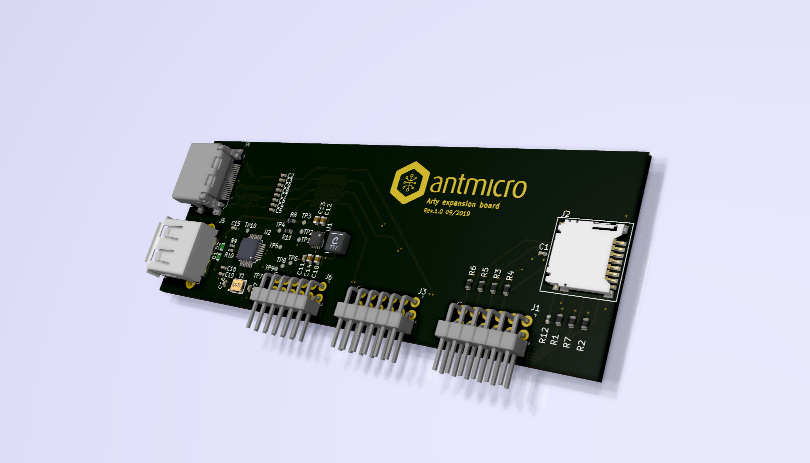
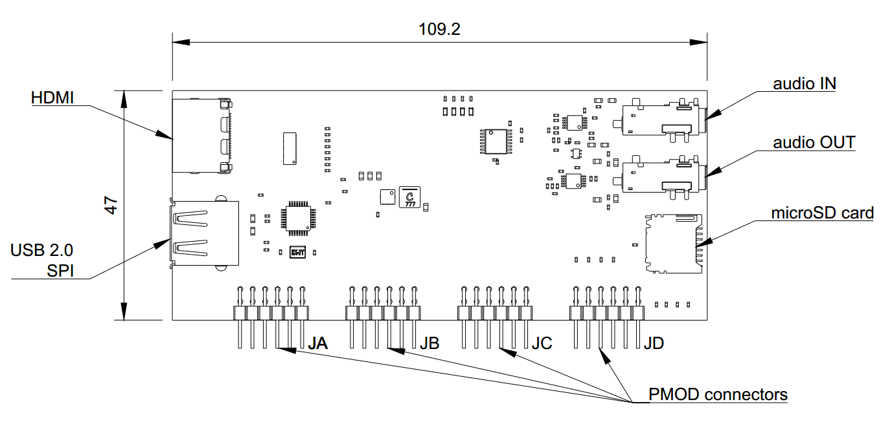

Arty A7 expansion board
=======================

This repository contains open hardware design files for expansion board compatible with Digilent `Arty A7 development platform <https://store.digilentinc.com/arty-a7-artix-7-fpga-development-board-for-makers-and-hobbyists/>`_.
The design files were prepared by `Antmicro <https://www.antmicro.com>`_.
The expansion board utilizes a set of PMOD connectors on Arty board to provide additional IO interfaces.

Key features
------------

* HDMI connector
* SD card connector
* USB 2.0 host controller implemented with `MAX3421EEHJ <https://datasheets.maximintegrated.com/en/ds/MAX3421E.pdf>`_

Dimensions and layout
---------------------

Image below shows Arty Expansion board's dimensions and layout.

