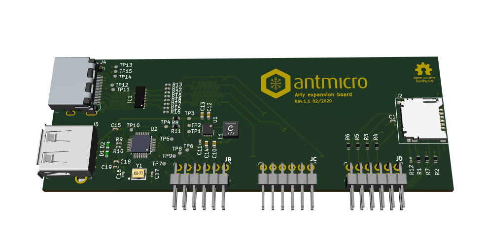

================================
Antmicro Arty A7 expansion board
================================

Copyright (c) 2020 `Antmicro <https://www.antmicro.com>`_

Overview
========

This repository contains open hardware design files for expansion board compatible with Digilent `Arty A7 development platform <https://store.digilentinc.com/arty-a7-artix-7-fpga-development-board-for-makers-and-hobbyists/>`_.
The expansion board utilizes a set of PMOD connectors on Arty board to provide additional IO interfaces.

Repository structure
====================

The main repository directory contains the KiCAD design files, LICENSE and README.
The remaining files are stored in the following directories:

* ``3d-model`` -  contains mechanical model of the board
* ``lib`` - contains the component libraries
* ``doc`` - contains selected files for device fabrication (schematic in PDF, BoM)
* ``img`` - contains graphics for this README

Key features
============

* HDMI connector
* microSD card connector
* USB 2.0 host controller implemented with `MAX3421EEHJ <https://datasheets.maximintegrated.com/en/ds/MAX3421E.pdf>`_
* audio interface
* GPIO expander with LED indicators

